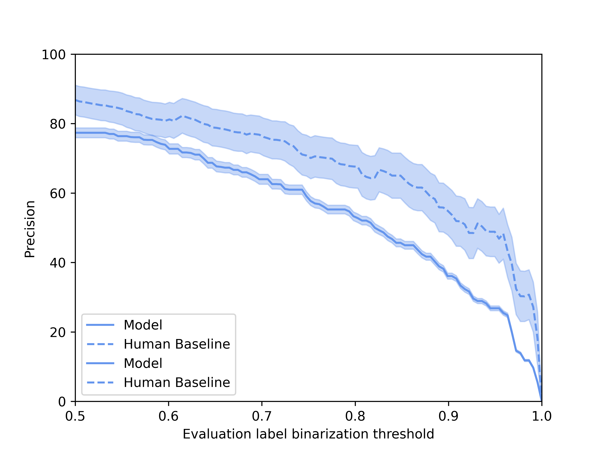
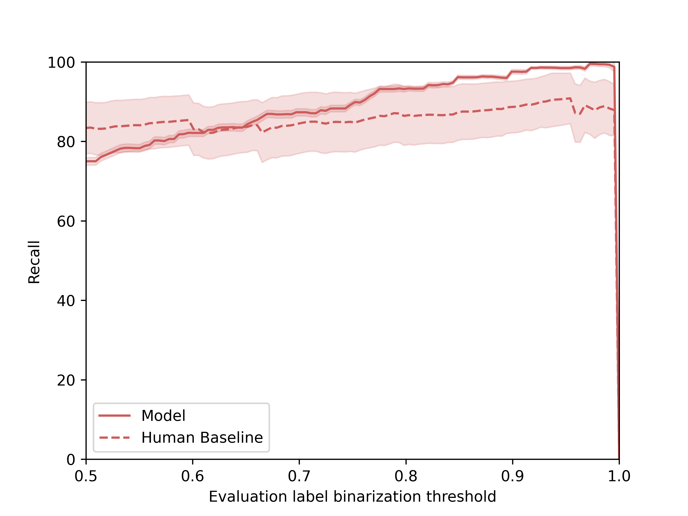
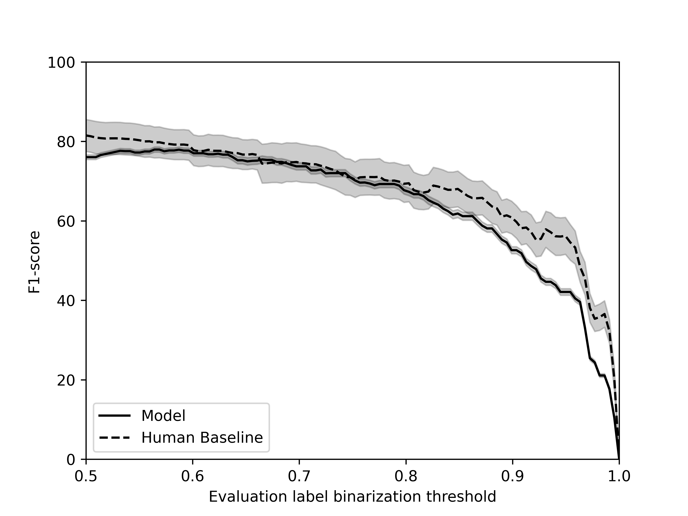

# Predicting Alarm Audibility Using Deep Learning

This code is part of an academic publication, and complements the research paper:
> F. Effa, J.-P. Arz, R. Serizel and N. Grimault. Evaluating and predicting the audibility of acoustic alarms in the workplace using experimental methods and deep learning, *Applied Acoustics*, Volume 219, 2024.

## Citation
In case you use the code or dataset, please consider citing our paper as:
```bibtex
@article{EFFA2024109955,
title = {Evaluating and predicting the audibility of acoustic alarms in the workplace using experimental methods and deep learning},
journal = {Applied Acoustics},
volume = {219},
pages = {109955},
year = {2024},
issn = {0003-682X},
doi = {https://doi.org/10.1016/j.apacoust.2024.109955},
url = {https://www.sciencedirect.com/science/article/pii/S0003682X24001063},
author = {F. Effa and J.-P. Arz and R. Serizel and N. Grimault},
keywords = {Psychoacoustics, Alarms, Audibility, Occupational noise, Convolutional Neural Network, Dataset},
}

```

## Dataset
A dataset has been collected for the purposes of the study. It is publicly accessible on Zenodo and has to be downloaded to run the programs contained in the present repository.
&nbsp;

[](https://doi.org/10.5281/zenodo.11353196)

## How to run the code
1) Place the [application/](./application) and [scheme/](./scheme) folders under a folder called `predicting_alarm_audibility/`.
2) Download the [dataset](https://doi.org/10.5281/zenodo.8417086).
3) Unzip `data.zip`, `features.zip`, and `trained_models.zip` under their corresponding sub-folders within the [application/](./application) folder.
4) Enter the [application/](./application) folder : `cd predicting_alarm_audibility/application`.

### Human baseline performance
```python
compute_human_performance.py
---------------------------------------------------------
Development data - Majority Voting
	     AUROC: 87.68 ± 1.71,     	 F1: 87.70 ± 1.79
Evaluation data - Majority Voting
	     AUROC: 84.53 ± 1.79,     	 F1: 82.78 ± 2.82
Evaluation data - Average Psychometric Function
	     AUROC: 97.01 ± 0.49,     	 F1: 83.48 ± 2.93
```
### Model performance over 10 runs
```python
compute_trained_models_performance.py
-------------------
AUROC: 85.84 ± 0.75
   F1: 76.03 ± 0.57
```

### Audibility criterion: effect on performance of the evaluation label binarization threshold
`binarization threshold.py` computes model and human baseline performance in terms of precision, recall and F1-score for evaluation label binarization thresholds varying
between 0.5 and 1, similar to what was done in the paper. 

<p align="center">
	
</p>

### Model training
`main_train.py` provides an example of code that could be run to train models similarly to what was done in the paper.
